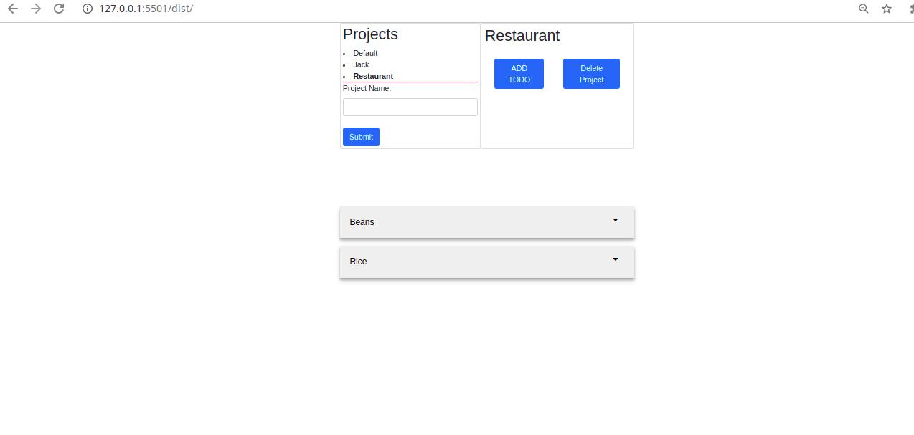

# to-do-list

## GIF

## Built With

- HTML,
- CSS,
- JavaScript,


## Live Demo

[Live Demo](https://aye-todolist.netlify.app/)
## Getting Started

To get a local copy up and running follow these simple example steps.

### Prerequisites

- A compatible browser with HTML, CSS and JavaScript. 

### Install

```
- git clone https://github.com/Alaska01/ToDoList;
- cd ToDoList/
- npm install
- npm webpack --watch
```
### Testing

```
- git clone https://github.com/Alaska01/ToDoList;
- cd ToDoList/
- npm install --save-dev jest
- npm webpack --watch
- npm run test
```

### Usage

- Open the index.html file in any browser or edit using Visual Code or the preference IDE for web development


## Author

👤 **Aye Daniel Asoo**

## Author
- Github: https://github.com/Alaska01
- LinkedIn: https://www.linkedin.com/in/daniel-asoo-aye/
- Twitter: https://twitter.com/AyeAsoo

## 🤝 Contributing

Contributions, issues and feature requests are welcome!

Feel free to check the [issues page](https://github.com/Alaska01/ToDoList/issues)

## Show your support

Give a ⭐️ if you like this project!

## Acknowledgments

- The Odin Project

## 📝 License

This project is free to use as learning purposes. For any external content (e.g. logo, images, ...), please contact the proper author and check their license of use.
